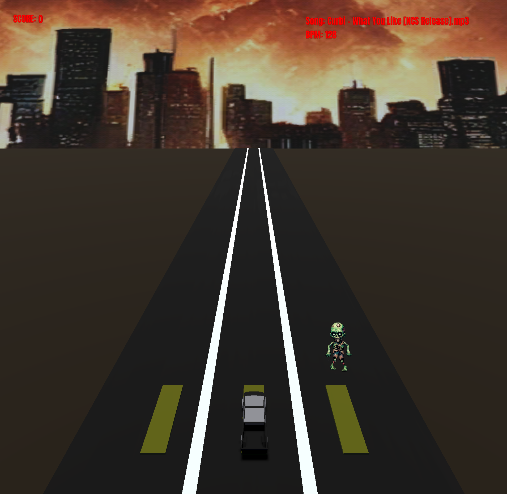

# Zombie Bash
<a href="https://robrob7.github.io/Team-Zombie-Bash/WebGame/index.html" target="_blank" rel="noopener noreferrer">Play Now</a>

Zombie Bash is a rhythm-based driving game developed in Godot 4.3, featuring beat-synchronized enemy spawning, physics-driven vehicle controls, and dynamic scoring. The player maneuvers a truck through waves of zombies that appear in time with the background track, merging rhythm mechanics with action gameplay.




Development Team:
- Robert Armendariz [RobRob7]
- Tyreke Hetzel [Hakka2424]
- Garrett Turner [gturner9371213]
- Aren Trombley [arentschool]

<h2>

Requirements
</h2>

- To play: browser that supports WebAssembly and WebGL 2.0 (Firefox, Chrome, Opera, Edge)
- To open with Godot: Godot v4.3 required 
    - ```git clone https://github.com/RobRob7/Team-Zombie-Bash.git```
    - Import project with Godot using ```zombie-bash/project.godot```

<h2>

Features
</h2>

- Player Movement
    - Trucks moves to path with keys A W D (left, middle, right)
- Song Selection
    - Select from available songs
- Difficulty Tuning
    - Easy: slow zombie spawn and speed
    - Medium: moderate zombie spawn and speed
    - Hard: fast zombie spawn and speed
- Scoring System
    - Strike down zombies to score points
    - Consecutive hits will multiply score
    - Missing a zombie will reset multiplier to 1

<h2>

Project Structure
</h2>

Project source files are found in folder ```zombie-bash/```
- **Scripts/**
    - `ArrowButton.gd`
    - `Camera.gd`
    - `Conductor.gd`
    - `Credits.gd`
    - `End.gd`
    - `Game.gd`
    - `Global.gd`
    - `HowToPlay.gd`
    - `MainMenu.gd`
    - `Note.gd`
    - `Player.gd`
    - `Settings.gd`
    - `SongSelectionMenu.gd`
- **Scenes/**
    - `ArrowButton.tscn`
    - `BloodSplatter.tscn`
    - `Conductor.tscn`
    - `Credits.tscn`
    - `End.tscn`
    - `Game.tscn`
    - `Global.tscn`
    - `HowToPlay.tscn`
    - `LaneSystem3D.tscn`
    - `MainMenu.tscn`
    - `Note.tscn`
    - `Player.tscn`
    - `Settings.tscn`
    - `SongSelectionMenu.tscn`
  
- **Fonts/**
    - Fonts used
- **Frames/**
    - Animation frames for zombies
- **Sounds/**
    - **Audio/**
        - Audio sound bites
    - **Songs/**
        - Songs implemented in game
- **Sprites/**
    - **game/**
        - Sprites for game objects
    - **ui/**
        - Sprites for the UI
